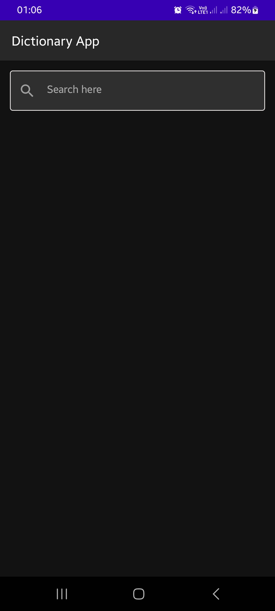

Dictionary App
==============
This is a simple dictionary app built with jetpack compose, and  made use of the dictionary api.

## Features
- Search for a word
- Get the meaning of the word
- Get the synonyms of the word
- Get the antonyms of the word
- Get the examples of the word
- Get the pronunciation of the word

## Screenshots
### Home Screen

### Search Screen

### Word Screen

## Libraries Used
- [Jetpack Compose](https://developer.android.com/jetpack/compose) - A modern toolkit for building native Android UI.
- [Retrofit](https://square.github.io/retrofit/) - A type-safe HTTP client for Android and Java.
- [Coil](https://coil-kt.github.io/coil/compose/) - An image loading library for Android backed by Kotlin Coroutines.
- [Hilt](https://dagger.dev/hilt/) - A dependency injection library for Android that reduces the boilerplate of doing manual dependency injection in your project.
- [Coroutines](https://kotlinlang.org/docs/coroutines-overview.html) - A coroutine is a concurrency design pattern that you can use on Android to simplify code that executes asynchronously.
- [Flow](https://kotlinlang.org/docs/flow.html) - A flow is an asynchronous version of a Sequence, a type of collection whose values are lazily produced.
